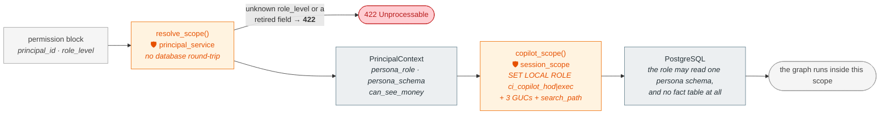
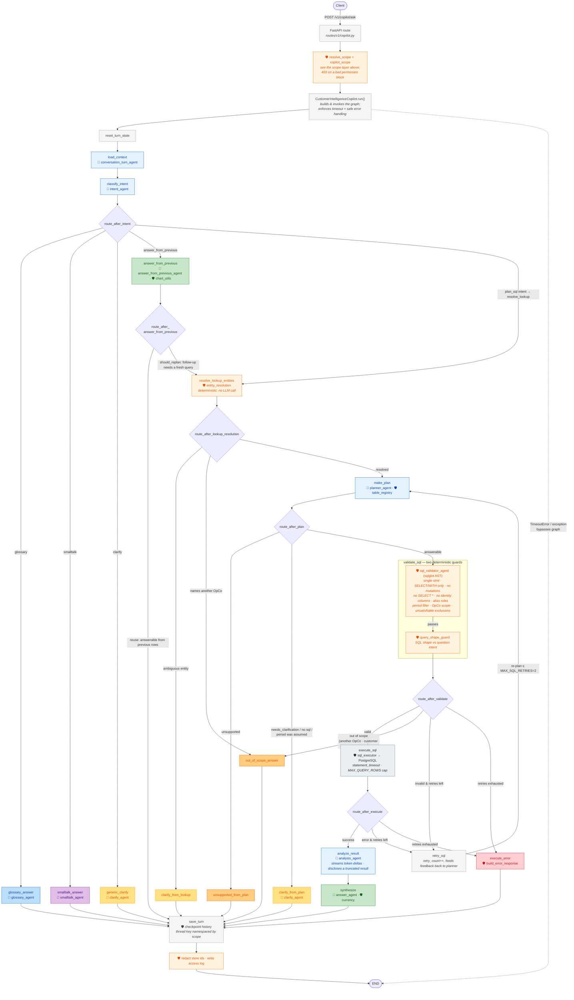
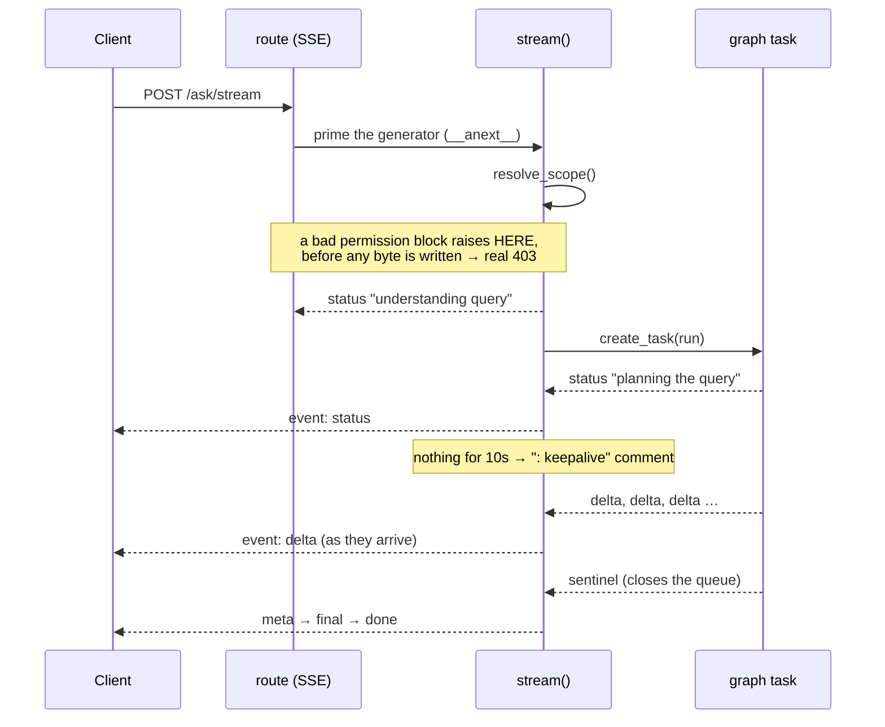

# Customer Intelligence Copilot — `/ask` Technical Flow

A `POST /v1/copilot/ask` request is orchestrated by a **LangGraph** state machine
(`build_copilot_graph`). Every request runs the same skeleton
(`reset → load context → classify intent`), fans out into one terminal branch
that produces a typed `result`, then checkpoints the turn.

Two kinds of workers appear at the nodes:

- **🤖 LLM agent** — calls `llm_service` (Gemini / Vertex / OpenAI). Non-deterministic.
- **🛡️ Guard / service** — deterministic code: scope resolution, SQL safety checks (sqlglot AST), shape guards, entity matching, chart building.

The division is deliberate: **the LLM reports facts, the code makes decisions.** A
model may say "the question names a store" or "this period was assumed"; whether that
is answerable, in scope, or safe to run is never its call.

> Renders natively on GitHub/GitLab/Notion/Obsidian, or paste the block into [mermaid.live](https://mermaid.live).
> `copilot_ask_flow.png` is an export of the diagram below and goes stale independently — regenerate it if you change the graph.

---

## Before the graph: the persona layer

No node in the graph can widen what the caller sees, because the role the session
runs as is fixed before the graph is built — and it is PostgreSQL, not the prompt,
that decides what that role may read.

| Step | What it guarantees |
|---|---|
| `resolve_scope()` | Synchronous and total. There is nothing left to look up: `PermissionContext` validates `role_level` at the edge, so an unknown value is a `422` before this runs, and a retired `opco_codes`/`category_keys` field is a `422` naming it. |
| `copilot_scope()` | `SET LOCAL ROLE` into the caller's persona role, then two GUCs (`app.principal_id`, `app.role_level`) and a `search_path` naming the persona schema. There were six: three were read by RLS predicates, and `app.min_cell_size` drove small-cell suppression. |
| Persona role | `HOD` runs as `ci_copilot_hod`, `EXEC` as `ci_copilot_exec`. Each may read exactly one persona schema, and **neither holds any privilege on the fact tables** — so a query naming `ci_hod.v_sales_daily` or `ci_core.fact_sales_daily` as an executive is refused by the database, not by the validator. |
| Persona schema | `role_level` picks `ci_hod` (money present) or `ci_exec` (money columns **physically absent**), so an EXEC query touching revenue fails to resolve instead of quietly returning zeros. |
| `assert_scope_active()` | Refuses to run any generated SQL unless the session role is the one this caller's `role_level` maps to. A `HOD` session running as `ci_copilot_exec` is a scope-assembly bug; the reverse is a privilege escalation. |
| Category depth routing | `CATEGORY_DEPTH` drops any table shallower than the category the **question** names — `agg_sales_daily` stops at level 2, so a level-4 question answered there would be about a coarser category than the one asked for. |

One thing worth knowing, because it changed:

- There is **no OpCo or category scoping**. Every caller sees every OpCo and every
  product category, so a question naming one is never refused — it is answered, or
  clarified if the name is ambiguous. `opco_codes`, `category_keys`,
  `category_names` and `is_group_user` are not part of the permission block and are
  rejected with a `422` rather than ignored.

---

## End-to-End Flowchart

**`result.type` legend:**
🟩 `analytics` · 🟦 `glossary` · 🟪 `smalltalk` · 🟨 `clarify` · 🟧 `unsupported` / `out_of_scope` · 🟥 `error`

---

## `/ask/stream` — the same graph, incrementally

`POST /v1/copilot/ask/stream` runs the identical graph and returns the identical
`final` payload. The graph is not itself an async generator, so token deltas travel
out through a queue: `analysis_agent` writes to a `ContextVar`-scoped writer, and the
route forwards each item the moment it appears.

Frame order is `status`* → `delta`* → `meta` → `final` → `done`, with `: keepalive`
comments wherever a stage runs longer than 10s. Analytics answers stream real token
deltas; every other `type` arrives as a single delta, so a client renders both the
same way.

Three properties are load-bearing, and each was once wrong:

| Property | Why it matters |
|---|---|
| Scope resolved **before the first yield** | Once a byte is out the status line is committed to `200`, and a provisioning fault could only be reported as an error event saying "please retry" — advice that cannot work. |
| Termination by **sentinel**, not polling | The producer closes the queue on every exit path, so the consumer blocks until there is something to send instead of waking every 250 ms to re-check a flag. |
| Producer **cancelled in `finally`** | A disconnect arrives as `GeneratorExit`, a `BaseException` invisible to `except Exception`. Without this the graph kept running for 13+ seconds and its SQL then tripped the role assertion, because the request scope had been torn down underneath it. |

---

## Agents & Guards Roster

### 🤖 LLM agents (call `llm_service`)
| Agent | Node(s) | Job |
|---|---|---|
| `conversation_turn_agent` | `load_context` | Decide how this turn relates to the previous one |
| `intent_agent` | `classify_intent` | Classify into one of the 5 routes |
| `answer_from_previous_agent` | `answer_from_previous` | Reuse prior data, or flag `should_replan` |
| `glossary_agent` | `glossary_answer` | Explain a term / metric |
| `smalltalk_agent` | `smalltalk_answer` | Conversational reply |
| `clarify_agent` | `generic_clarify`, `clarify_from_plan` | Ask a targeted follow-up |
| `planner_agent` | `make_plan` | Generate SQL, and **report** whether the period was stated or assumed |
| `analysis_agent` | `analyze_result` | Interpret returned rows; streams the answer token by token |
| `answer_agent` | `synthesize` | Compose final narrative + chart spec |

`resolve_lookup_entities` is **not** in this table any more. Entity resolution makes
no per-turn LLM call and no `pg_trgm` round trip — both are gone from
`entity_resolution/matcher.py`, replaced by one in-process scorer over a cached
dictionary. That is what makes a lookup reproducible: the same question resolves the
same way twice.

### 🛡️ Deterministic guards & services
| Guard / service | Where | Job |
|---|---|---|
| `principal_service` | before the graph | Resolve the permission block into a persona role and schema. No database round-trip — there is nothing left to expand |
| `session_scope` | before the graph | `SET LOCAL ROLE` into the persona role + 3 GUCs + persona `search_path`; asserts the role matches `role_level` |
| `entity_resolution/` | `resolve_lookup_entities` | Match store / category / enum phrases against the cached dictionary; non-overlapping spans, longest match wins |
| `sql_validator_agent` | `validate_sql` | sqlglot AST checks: single statement, SELECT/WITH only, no mutations, no `SELECT *`, no customer identity, alias and period rules, unsatisfiable exclusions |
| `query_shape_guard` | `validate_sql` | Confirms the SQL shape matches the question's intent |
| `table_registry` | `make_plan` | Table allow-list, filtered by the depth of the category the question names |
| `sql_guards` | `load_context` | Time-period guard question for unbounded asks |
| `sql_executor` | `execute_sql` | Runs the query, asserts the session role matches `role_level`, caps the result at `MAX_QUERY_ROWS` in the database |
| `currency` | `synthesize`, `analyze_result` | Decides which result columns are money **from the SQL AST**, then labels them `RM` / `MYR` |
| `chart_utils` | `answer_from_previous` | Point/line normalisation for reused rows |

### Cross-cutting (every request)
| Service | Role |
|---|---|
| `copilot_service` | Graph orchestrator + `run()` guardrail (timeout / exception → `error`) |
| `db` / `checkpoint` | Postgres checkpoint saver. The thread key is namespaced by **user + scope**, so a re-scoped caller cannot replay another scope's rows through `answer_from_previous` |
| `access_log_service` | One authorization row per request: real `principal_id`, role level, denial reason, trace id |
| `copilot_usage_service` | Latency / token usage tracker |
| `mlflow_observability` | Tracing + PII redaction |
| `stream_context` | The `ContextVar` writer: token deltas and progress statuses for `/ask/stream` |

---

## The failure mode this whole shape defends against

Not an exception — a **confident zero**. Three very different situations produce the
same-looking number:

| Looks like `0` / `null` | Actually |
|---|---|
| no matching rows | Genuinely empty. The answer must say "no records", never "zero", and must not claim anything was withheld — nothing is. |
| a refusal | A privacy or role boundary. Must be `out_of_scope` / `unsupported` with a policy notice, never a number. |
| a gap in the seed data | A test problem, which is what `tests/test_seed_data.py` exists to catch. |

Every guard above exists to keep those three distinguishable in the response. See
`TESTING.md` for how to tell them apart when checking a suspicious answer.
